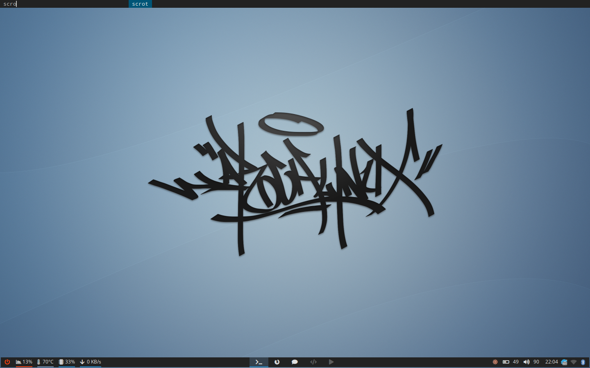
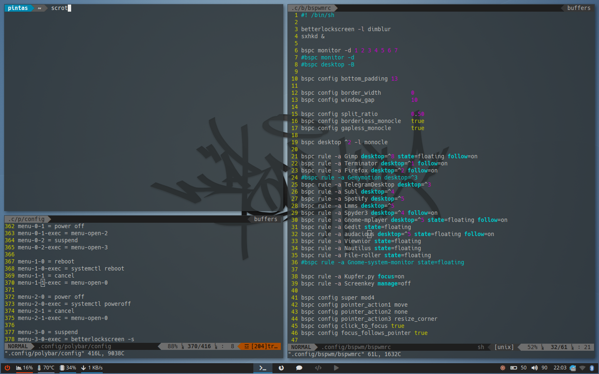

# dotfiles
#### Some config files intended for personal reference. Many of these files are still being edited or are completely useless, so mind that.

.System: arch linux
.DM: bspwm
.Bar: polybar
.Menu: dmenu
.Lockscreen: betterlockscreen
.Fonts: Noto Sans; Wuncon Siji, Awesome
.Wallpaper: Arch Linux by [hundane](https://www.deviantart.com/art/Arch-Linux-163630829)

Clean:

Busy:

